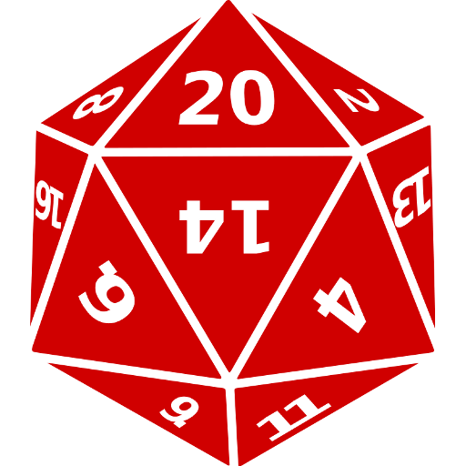

<style type="text/css">
.main-container {
  max-width: 1800px;
  margin-left: auto;
  margin-right: auto;
}
</style>

<style>
div.blue { background-color:#63a898; border-radius: 5px; padding: 20px;}
</style>
<div class = "blue">


<style>
div.blue { background-color:#63a898; border-radius: 0px; padding: 20px;}
</style>
<div class = "blue">


## [HOME](http://AR-Polyhedron.github.io/) | [ABOUT ME](http://AR-Polyhedron.github.io/About_Me/) | [CV](http://AR-Polyhedron.github.io/CV/) | [PROGRAMMING](http://AR-Polyhedron.github.io/Programming/) | [RESEARCH](http://AR-Polyhedron.github.io/Research/) 


<div style= "float:left;position: relative;top:20px">
```{r, out.width = "250px",echo=FALSE}

```


</div>

### My name is Alexander Raab, I am born and raised in Utah Valley and currently a graduate of Utah Valley University. I have acquired an Associate's of Science in Biology and will be graduating with my Bachelor's in Biology on 8/19/2020.I hope to continue to grow my career by pursuing a Master's in the study of Genetics. Particularly Gene silencing mechanisms. As well as a career working within the lab. 
<br><br>

<div style= "float:left;position: relative;top:20px">
```{r, out.width = "250px",echo=FALSE}

```
</div>

### My Hobbies are broad as I grew up in a very nerd culture household. The main ones are General Gaming, Writing, Reading, Trading Card Games,and the culimiation of all my hobbies Table Top Role Playing Games. I grew up under the house of a Game Manager for several systems and have grown to be one myself.Dungeon's and Dragon's 3rd and 5th edition being the primary one and countless lesser known games. I am also quite the cook.

<br><br><br><br><br><br><br><br><br><br><br><br><br><br><br><br><br><br><br><br><br>

