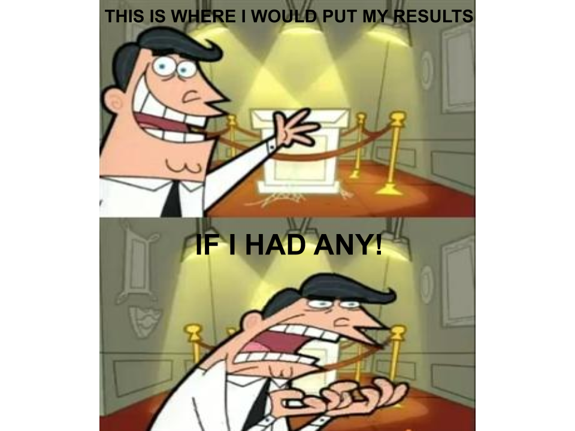

<style type="text/css">
.main-container {
  max-width: 1800px;
  margin-left: auto;
  margin-right: auto;
}
</style>

<style>
div.blue { background-color:#63a898; border-radius: 5px; padding: 20px;}
</style>
<div class = "blue">


<style>
div.blue { background-color:#63a898; border-radius: 0px; padding: 20px;}
</style>
<div class = "blue">


## [HOME](http://MurderousPolyhedron.github.io/) | [ABOUT ME](http://MurderousPolyhedron.github.io/About_Me/) | [CV](http://MurderousPolyhedron.github.io/CV/) | [PROGRAMMING](http://MurderousPolyhedron.github.io/Programming/) | [RESEARCH](http://MurderousPolyhedron.github.io/Research/) 


<div style= "float:right;position: relative;top:10px">
```{r, out.width = "600px",echo=FALSE}

```

# Broad Host Range Plasmids

From 2018 to now I have been under the mentorship of Dr. Lauren Brooks as one of her research students. Together we have been working on a continuation of her paper [Where the plasmids roam: large-scale sequence analysis reveals plasmids with large host ranges.](https://www.ncbi.nlm.nih.gov/pmc/articles/PMC6412061/). The Goal of the research to demonstrate previous findings in a laboratory setting. This project has lacked demonstratable results, this however not due to the experiment being a failure. The first year and a half of the research was devoted to getting funding and then getting results. Our PCR methods initially weren't working and required many months of fine tuning. As a result I am very adept at PCR, Electrophresis, and DNA extraction as I have done it dozens of times. The experiment did start recieving results early this year after. However due to the Covid-19 pandemic the lab has been shutdown and the results I did have are on a campus computer I do not have access to until the pandemic is over. We plan on continuing our research after the pandemic if it ends by the summer. So this section will hopefully be updated.

<br><br><br><br><br><br><br><br><br>

<div style= "float:right;position: relative;top:10px">
```{r, out.width = "600px",echo=FALSE}
knitr::include_graphics("../Research/Fungi_Poster.png")
```

# Mycology Survey of Utah

During the 2019 Fall Semester a student research team composed of Heather Moon, Alex Jones, Clayton Rawson, Kristina Nolff, and myself performed a Mycology Survey of Utah under Dr. Geoffrey Zahn's mentorship. Together we gained funding to perform a survey of mycological species in utah, we cultured 72 samples across all the environments of utah. Of those 72 cultures we found substantion DNA evidence of 15 unidentified species. The results were then presented along with Dr. Zahn's other research team's results at Utah Valley University. Though the work wasn't published nor the project continued. This was decided as categorizing any one of the species would be aproximately one year of work and the team was mostly seniors or graduating students.

<br><br><br><br><br><br><br><br><br>
<br><br><br><br><br><br><br><br><br>
<br><br><br><br><br><br><br><br><br>


